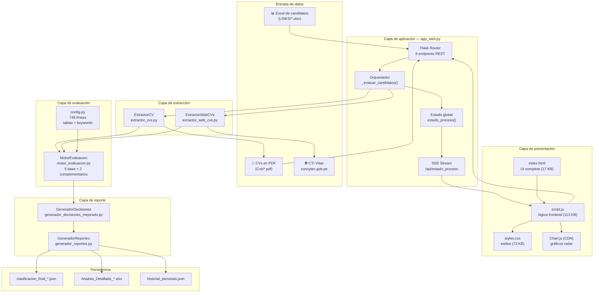
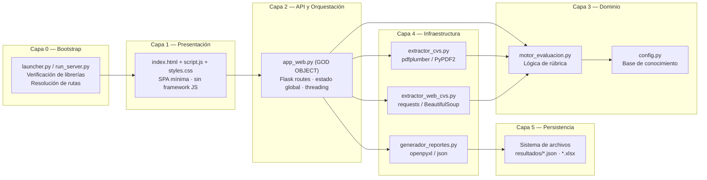
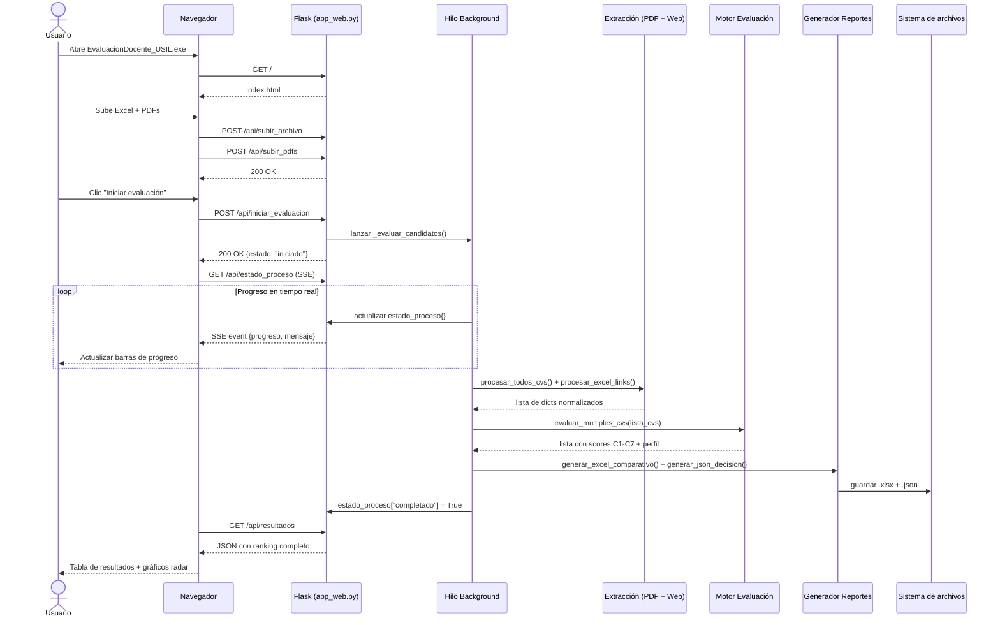
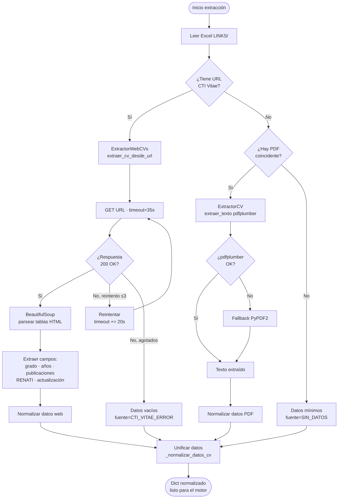
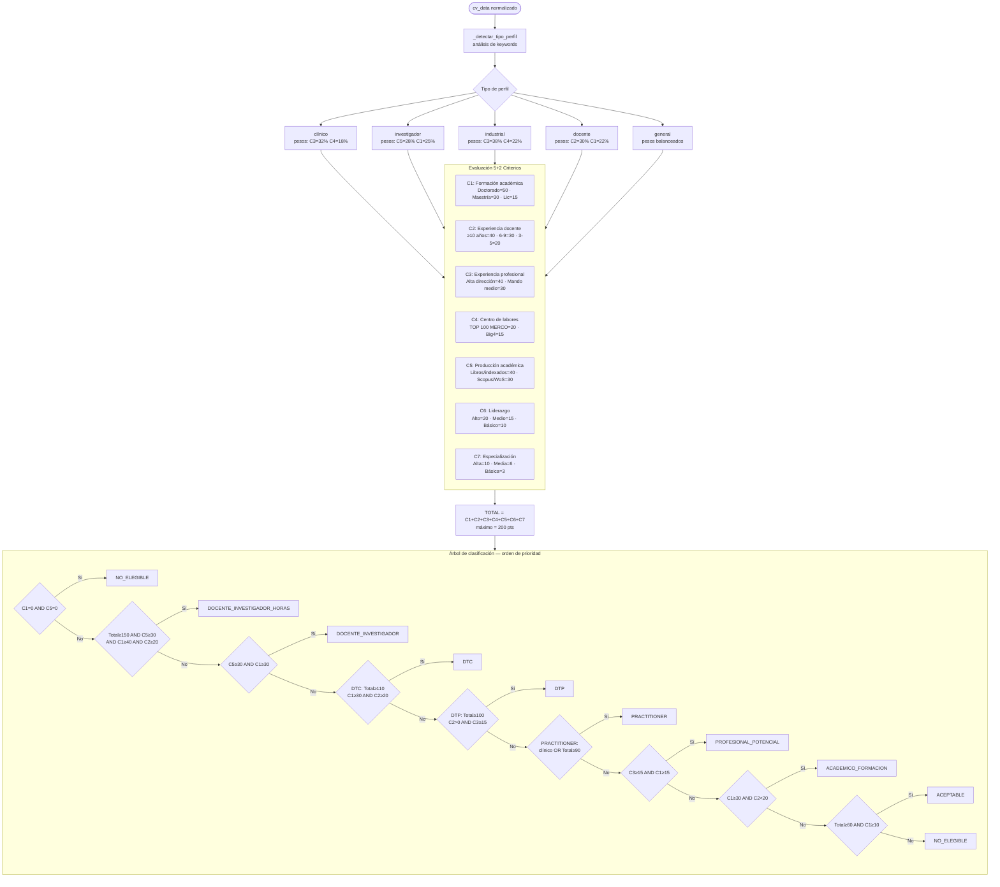
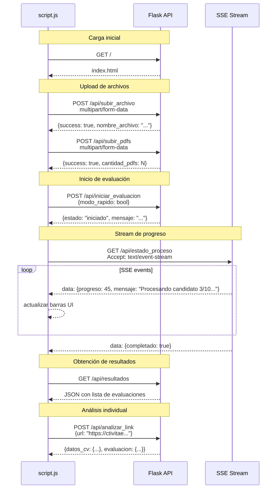
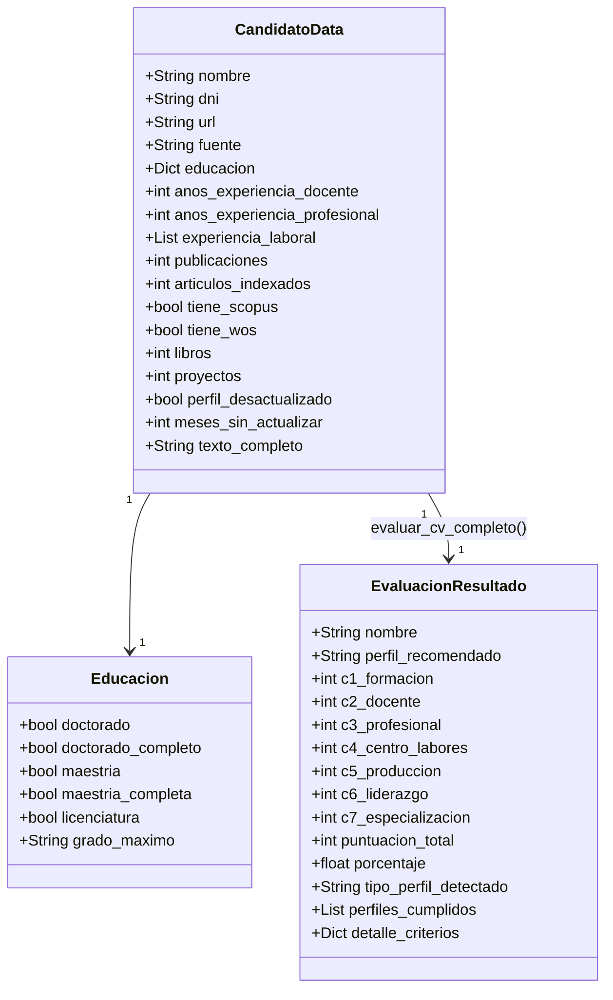
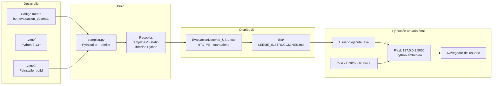
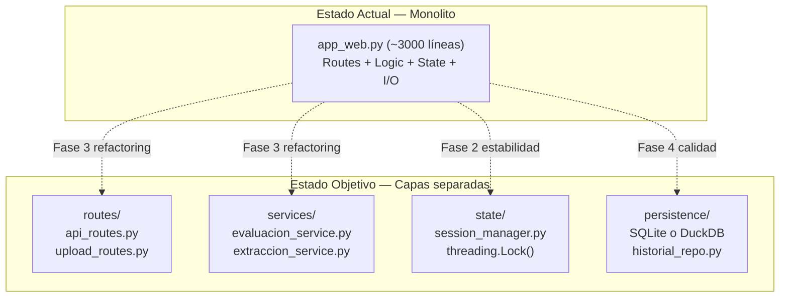

# Arquitectura del Sistema — Evaluación Automática de Docentes USIL

**Universidad San Ignacio de Loyola · People Analytics**
**Versión:** 3.0 · **Fecha:** 2026-06-01

---

## Índice

1. [Visión general](#1-visión-general)
2. [Patrón arquitectónico](#2-patrón-arquitectónico)
3. [Diagrama de componentes](#3-diagrama-de-componentes)
4. [Diagrama de capas](#4-diagrama-de-capas)
5. [Flujo de ejecución principal](#5-flujo-de-ejecución-principal)
6. [Flujo de extracción de datos](#6-flujo-de-extracción-de-datos)
7. [Motor de evaluación — lógica de clasificación](#7-motor-de-evaluación--lógica-de-clasificación)
8. [Comunicación frontend-backend](#8-comunicación-frontend-backend)
9. [Modelo de datos](#9-modelo-de-datos)
10. [Despliegue y distribución](#10-despliegue-y-distribución)
11. [Restricciones arquitectónicas](#11-restricciones-arquitectónicas)
12. [Deuda arquitectónica y evolución propuesta](#12-deuda-arquitectónica-y-evolución-propuesta)

---

## 1. Visión general

El sistema es un **monolito Flask de proceso único** distribuido como ejecutable Windows. Combina una interfaz web servida localmente con un pipeline de procesamiento de datos ejecutado en hilo de background. No requiere conectividad de red más allá del acceso a CTI Vitae (CONCYTEC) durante la extracción.

```
Entrada (Excel + PDFs)
        │
        ▼
┌───────────────────────────────────────────────────────────┐
│                EvaluacionDocente_USIL.exe                 │
│  Python 3.13 embebido · Flask 3.0 · todas las librerías   │
│                                                           │
│  [Servidor web local]  ◄──── Usuario (navegador)         │
│  [Pipeline de datos]   ──→   CTI Vitae (CONCYTEC)        │
│  [Sistema de archivos] ──→   resultados/ (JSON + Excel)  │
└───────────────────────────────────────────────────────────┘
```

---

## 2. Patrón arquitectónico

| Dimensión | Decisión | Justificación |
|-----------|---------|---------------|
| Estilo | Monolito de proceso único | Simplicidad de distribución como .exe |
| Concurrencia | Hilo de background para el pipeline | Evitar bloqueo del servidor web durante extracción larga |
| Persistencia | Sistema de archivos (JSON + Excel) | Sin necesidad de instalación de base de datos en el cliente |
| Interfaz | Flask + HTML/JS vanilla | Evita dependencias de build para el frontend |
| Distribución | PyInstaller (--onefile) | Un único archivo .exe portable |
| Comunicación asíncrona | Server-Sent Events (SSE) | Progreso en tiempo real sin WebSocket |

---

## 3. Diagrama de componentes



---

## 4. Diagrama de capas



---

## 5. Flujo de ejecución principal



---

## 6. Flujo de extracción de datos



---

## 7. Motor de evaluación — lógica de clasificación



---

## 8. Comunicación frontend-backend



---

## 9. Modelo de datos

### Estructura del dict de candidato (circula por todo el pipeline)



### Esquema JSON de salida (`clasificacion_final_*.json`)

```json
{
  "timestamp": "2026-06-01T10:30:00",
  "total_evaluados": 25,
  "resumen": {
    "DTC": 3,
    "DTP": 8,
    "PRACTITIONER": 5,
    "NO_ELEGIBLE": 2
  },
  "ranking": [
    {
      "posicion": 1,
      "nombre": "...",
      "dni": "...",
      "perfil_recomendado": "DTC",
      "puntuacion_total": 145,
      "porcentaje": 72.5,
      "c1_formacion": 40,
      "c2_docente": 30,
      "c3_profesional": 30,
      "c4_centro_labores": 15,
      "c5_produccion": 20,
      "c6_liderazgo": 10,
      "c7_especializacion": 0
    }
  ]
}
```

---

## 10. Despliegue y distribución



**Requisitos en el equipo del usuario final:**
- Windows 10 / 11 (x64)
- Sin Python instalado (embebido en el .exe)
- Sin instalación de librerías
- Conexión a Internet para extracción de CTI Vitae

---

## 11. Restricciones arquitectónicas

| Restricción | Descripción | Impacto |
|------------|-------------|---------|
| **Sin base de datos** | Todo el estado en archivos JSON/Excel | No escala a múltiples usuarios concurrentes |
| **Un solo usuario simultáneo** | Estado global compartido sin aislamiento de sesión | Dos ejecuciones paralelas corrompen `estado_proceso` |
| **Solo localhost** | Flask no implementa autenticación | No puede desplegarse en servidor compartido sin cambios |
| **Dependencia de CTI Vitae** | No existe API oficial; el scraper depende del HTML actual | Cambios en la web de CONCYTEC rompen el pipeline |
| **Lista MERCO hardcodeada** | 150+ empresas TOP en `config.py` | Requiere modificar código para actualizar la lista anualmente |
| **Windows solamente** | Rutas con `os.path.join` y carpetas con nombres en español | La distribución .exe es exclusiva para Windows |

---

## 12. Deuda arquitectónica y evolución propuesta

### Estado actual vs. estado objetivo



### Roadmap de evolución

| Fase | Descripción | Prioridad | Esfuerzo estimado |
|------|-------------|-----------|-------------------|
| **Fase 1 — Seguridad** | Hash de DNI · sanitización de uploads · audit log | CRÍTICA | 3 días |
| **Fase 2 — Estabilidad** | `threading.Lock` · manejo de errores de extracción · `None` vs `0` | ALTA | 2 días |
| **Fase 3 — Mantenibilidad** | Dividir `app_web.py` en routers + services | ALTA | 5 días |
| **Fase 4 — Calidad** | Suite pytest · CI básico · type hints en `app_web.py` | MEDIA | 5 días |
| **Fase 5 — Configuración** | Externalizar lista MERCO a Excel · UI de configuración | MEDIA | 2 días |
| **Fase 6 — Escalabilidad** | SQLite como backend · soporte multi-usuario | BAJA | 10 días |

---

*Universidad San Ignacio de Loyola · People Analytics · 2026*
