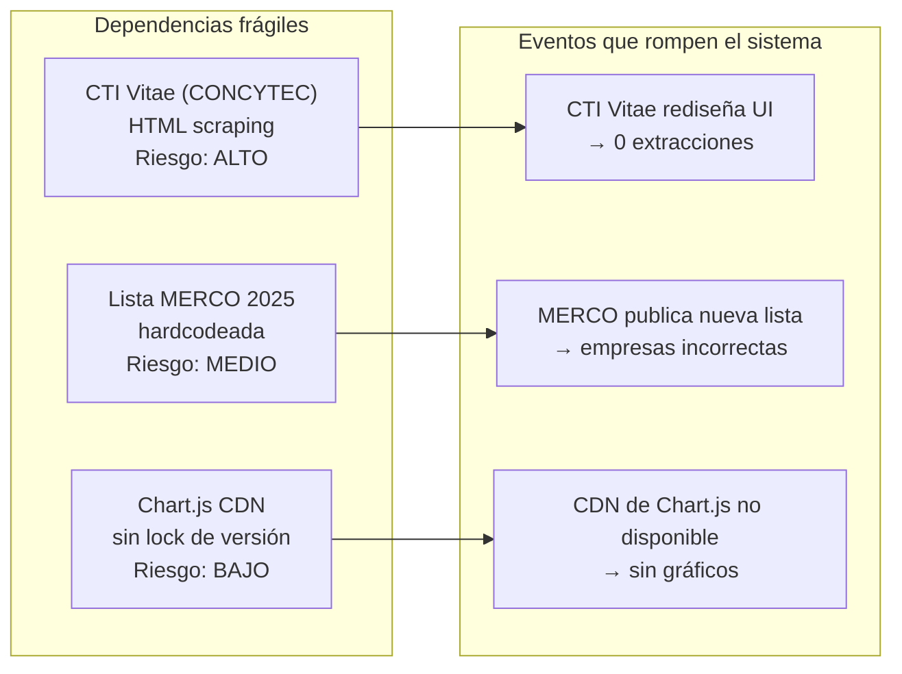

# Auditoría de Código — Sistema de Evaluación Automática de Docentes USIL

**Universidad San Ignacio de Loyola · People Analytics**
**Audiencia:** Arquitectos de software, equipo de TI, auditoría institucional
**Versión del sistema auditado:** 3.0 · **Fecha de auditoría:** 2026-06-01
**Metodología:** Análisis estático de código fuente + revisión de arquitectura

---

## Índice

1. [Resumen ejecutivo](#1-resumen-ejecutivo)
2. [Métricas de calidad](#2-métricas-de-calidad)
3. [Vulnerabilidades de seguridad](#3-vulnerabilidades-de-seguridad)
4. [Deuda técnica](#4-deuda-técnica)
5. [Análisis por módulo](#5-análisis-por-módulo)
6. [Riesgos de mantenimiento](#6-riesgos-de-mantenimiento)
7. [Riesgos de escalabilidad](#7-riesgos-de-escalabilidad)
8. [Cumplimiento normativo](#8-cumplimiento-normativo)
9. [Plan de remediación](#9-plan-de-remediación)
10. [Archivos candidatos a eliminación](#10-archivos-candidatos-a-eliminación)

---

## 1. Resumen ejecutivo

### Veredicto general

| Dimensión | Calificación | Justificación |
|-----------|:-----------:|---------------|
| Funcionalidad | ✅ ACEPTABLE | El sistema cumple su propósito y está en producción |
| Seguridad | ⚠ DEFICIENTE | DNI en texto plano, uploads sin sanitizar, sin auditoría |
| Arquitectura | ⚠ DEFICIENTE | God Object de 3 000 líneas, estado global sin locks |
| Calidad de código | ⚠ MODERADA | Núcleo bien estructurado; orquestador acoplado |
| Testabilidad | ❌ CRÍTICA | 0% cobertura automatizada; todos los tests son manuales |
| Mantenibilidad | ⚠ DEFICIENTE | Dependencias frágiles (CTI Vitae HTML, MERCO hardcodeado) |
| Documentación | ✅ MEJORADA | Mejorada con esta suite de documentos |

### Hallazgos críticos

1. **DNI almacenado en texto plano** en todos los archivos de resultados — riesgo Ley 29733
2. **`app_web.py` con ~3 000 líneas** viola SRP; imposible testear unidades individuales
3. **Estado global mutable sin locks** — race conditions bajo acceso concurrente
4. **Sin sanitización de nombre de archivo en uploads** — Path Traversal potencial (OWASP A05)
5. **0% cobertura de tests automatizados** — cualquier cambio puede introducir regresiones silenciosas

### Recomendación

El sistema puede continuar en producción **bajo uso controlado en localhost** sin modificaciones urgentes. Sin embargo, los ítems de seguridad (S-01 a S-04) deben remediarse **antes de cualquier despliegue en red institucional**.

---

## 2. Métricas de calidad

### Por módulo

| Módulo | Líneas | Complejidad | Type hints | Docstrings | Tests auto | Calificación |
|--------|-------:|:-----------:|:----------:|:----------:|:----------:|:------------:|
| `motor_evaluacion.py` | 1 134 | MEDIA | ~60% | ~70% | ❌ 0% | ★★★★☆ |
| `extractor_web_cvs.py` | 1 670 | ALTA | ~40% | ~50% | ❌ 0% | ★★★☆☆ |
| `config.py` | 748 | BAJA | ~80% | ~30% | N/A | ★★★☆☆ |
| `app_web.py` | ~3 000 | MUY ALTA | ~10% | ~20% | ❌ 0% | ★☆☆☆☆ |
| `extractor_cvs.py` | 387 | BAJA | ~50% | ~60% | ❌ 0% | ★★★★☆ |
| `generador_reportes.py` | 205 | BAJA | ~50% | ~60% | ❌ 0% | ★★★★☆ |
| `launcher.py` | 225 | BAJA | ~30% | ~40% | ❌ 0% | ★★★☆☆ |

### Indicadores globales

| Indicador | Valor | Evaluación |
|-----------|-------|:----------:|
| Total líneas de código (LOC) | ~8 000 | — |
| Cobertura de tests automatizados | **0%** | ❌ CRÍTICO |
| Duplicación de código estimada | **MODERADA** | ⚠ |
| Archivos legacy sin política de deprecación | 5+ | ⚠ |
| Módulos con deuda técnica crítica | 1 (`app_web.py`) | ⚠ |
| Valores mágicos hardcodeados | ~12 constantes | ⚠ |

---

## 3. Vulnerabilidades de seguridad

### S-01 — DNI en texto plano (CRÍTICA)

| Atributo | Detalle |
|---------|---------|
| **Severidad** | CRÍTICA |
| **Categoría** | Exposición de datos sensibles (PII) |
| **Norma afectada** | Ley N° 29733 — Ley de Protección de Datos Personales (Perú) |
| **Ubicación** | `resultados/clasificacion_final_*.json`, `historial_personas.json` |
| **Descripción** | Los archivos de salida JSON contienen el DNI de cada candidato en texto plano sin cifrado ni seudonimización. Cualquier persona con acceso al sistema de archivos puede leer directamente los documentos de identidad. |
| **Remediación** | Aplicar hash SHA-256 con salt institucional antes de escribir el DNI en archivos: `hashlib.sha256((DNI + SALT_INSTITUCIONAL).encode()).hexdigest()`. Guardar el DNI real solo en memoria durante la sesión, nunca en disco. |

```python
# Código actual (INSEGURO)
json.dump({"nombre": candidato["nombre"], "dni": candidato["dni"]}, f)

# Código remediado
import hashlib
SALT = os.environ.get("USIL_PII_SALT", "")  # Configurar en variable de entorno
dni_hash = hashlib.sha256((candidato["dni"] + SALT).encode()).hexdigest()
json.dump({"nombre": candidato["nombre"], "dni_hash": dni_hash}, f)
```

---

### S-02 — Sin sanitización de nombre de archivo en uploads (ALTA)

| Atributo | Detalle |
|---------|---------|
| **Severidad** | ALTA |
| **Categoría** | Path Traversal |
| **OWASP** | A05:2021 — Security Misconfiguration / A03:2021 — Injection |
| **Ubicación** | `app_web.py` — rutas `/api/subir_archivo` y `/api/subir_pdfs` |
| **Descripción** | Los nombres de archivo subidos por el usuario no se sanitizan con `werkzeug.utils.secure_filename()`. Un atacante podría subir un archivo con nombre `../../etc/passwd` o `..\\Windows\\system32\\file.dll` intentando escribir fuera del directorio de uploads. |
| **Remediación** | Aplicar `secure_filename()` de Werkzeug antes de cualquier operación de archivo. |

```python
# Código actual (INSEGURO)
filename = request.files['archivo'].filename
filepath = os.path.join(UPLOAD_FOLDER, filename)

# Código remediado
from werkzeug.utils import secure_filename
filename = secure_filename(request.files['archivo'].filename)
if not filename:
    return jsonify({"error": "Nombre de archivo inválido"}), 400
filepath = os.path.join(UPLOAD_FOLDER, filename)
```

---

### S-03 — Sin validación de tipo MIME en uploads (ALTA)

| Atributo | Detalle |
|---------|---------|
| **Severidad** | ALTA |
| **Categoría** | Carga de archivos maliciosos |
| **OWASP** | A03:2021 — Injection |
| **Ubicación** | `app_web.py` — handlers de upload |
| **Descripción** | El sistema valida solo la extensión del archivo (`.xlsx`, `.pdf`), no el contenido real. Un archivo ejecutable renombrado a `.pdf` pasaría la validación. |
| **Remediación** | Usar `python-magic` para verificar el tipo MIME real del contenido binario. |

```python
# Remediación
import magic

def es_pdf_valido(file_path: str) -> bool:
    mime = magic.from_file(file_path, mime=True)
    return mime == 'application/pdf'

def es_excel_valido(file_path: str) -> bool:
    mime = magic.from_file(file_path, mime=True)
    return mime in (
        'application/vnd.openxmlformats-officedocument.spreadsheetml.sheet',
        'application/vnd.ms-excel'
    )
```

---

### S-04 — Estado global compartido sin control de concurrencia (ALTA)

| Atributo | Detalle |
|---------|---------|
| **Severidad** | ALTA |
| **Categoría** | Race condition — integridad de datos |
| **Ubicación** | `app_web.py:49–64` — `estado_proceso` dict global |
| **Descripción** | El diccionario `estado_proceso` es modificado tanto por el hilo del servidor Flask (para lecturas en `/api/estado_proceso`) como por el hilo de background `_evaluar_candidatos()`. En Python, las operaciones sobre diccionarios no son atómicas a nivel de aplicación aunque el GIL mitigue algunos efectos. Una lectura parcialmente actualizada puede retornar datos inconsistentes. |
| **Remediación** | Proteger todas las escrituras con `threading.Lock()`. |

```python
# Remediación
import threading

_estado_lock = threading.Lock()
estado_proceso = { ... }

# En el hilo de background
def _actualizar_estado(clave: str, valor) -> None:
    with _estado_lock:
        estado_proceso[clave] = valor

# En el endpoint SSE
def leer_estado() -> Dict:
    with _estado_lock:
        return dict(estado_proceso)  # Retornar copia, no referencia
```

---

### S-05 — Sin log de auditoría (ALTA)

| Atributo | Detalle |
|---------|---------|
| **Severidad** | ALTA |
| **Categoría** | Trazabilidad y rendición de cuentas |
| **Ubicación** | Todo `app_web.py` |
| **Descripción** | El sistema no registra quién ejecutó qué evaluación, cuándo, con qué datos de entrada y qué resultados obtuvo. En un proceso de selección de personal, la trazabilidad es un requisito legal (Art. 20, Ley 29733). Si una decisión de contratación es impugnada, no hay registro que respalde el proceso. |
| **Remediación** | Implementar `logging.RotatingFileHandler` para registro de auditoría. |

```python
import logging
from logging.handlers import RotatingFileHandler

audit_logger = logging.getLogger('audit')
handler = RotatingFileHandler('audit.log', maxBytes=10*1024*1024, backupCount=5)
handler.setFormatter(logging.Formatter('%(asctime)s|%(message)s'))
audit_logger.addHandler(handler)
audit_logger.setLevel(logging.INFO)

# Uso en cada evaluación
audit_logger.info(
    f"EVALUACION_INICIADA|"
    f"usuario={os.getenv('USERNAME', 'desconocido')}|"
    f"archivo={nombre_excel}|"
    f"candidatos={cantidad}"
)
```

---

### S-06 — User-Agent de scraping sin identificación (MEDIA)

| Atributo | Detalle |
|---------|---------|
| **Severidad** | MEDIA |
| **Categoría** | Ética de scraping / cumplimiento de términos de uso |
| **Ubicación** | `extractor_web_cvs.py` — configuración de `requests.Session` |
| **Descripción** | Las peticiones HTTP a CTI Vitae usan un User-Agent genérico de navegador. CONCYTEC no puede identificar al agente institucional que realiza las consultas. En caso de bloqueo por volumen, no hay canal de comunicación institucional. |
| **Remediación** | Establecer un User-Agent institucional identificable. |

```python
# Remediación
session.headers.update({
    'User-Agent': 'USIL-PeopleAnalytics/3.0 (evaluacion-docente@usil.edu.pe)',
})
```

---

## 4. Deuda técnica

### DT-01 — God Object: app_web.py (CRÍTICA)

| ID | DT-01 |
|----|-------|
| **Severidad** | CRÍTICA |
| **Tipo** | Violación de principio de diseño (SRP) |
| **LOC afectados** | ~3 000 |
| **Descripción** | `app_web.py` concentra en un solo archivo: definición de rutas Flask, lógica de negocio (orquestación del pipeline), estado de aplicación, I/O de archivos, generación de reportes y comunicación SSE. Es imposible testear cualquier función de este módulo de forma aislada. Un bug en cualquier sección puede afectar funcionalidades no relacionadas. |
| **Desglose responsabilidades mezcladas** | Routing (8 endpoints) + Estado global (7 variables) + Upload handling + Pipeline orchestration + Report generation + SSE streaming |
| **Impacto** | Cualquier desarrollador nuevo debe leer ~3 000 líneas para entender el sistema. Los tests unitarios son imposibles sin refactoring previo. |
| **Solución** | Separar en módulos: `routes/`, `services/evaluacion_service.py`, `state/session_manager.py` |

---

### DT-02 — Tres versiones del generador de decisiones (ALTA)

| ID | DT-02 |
|----|-------|
| **Severidad** | ALTA |
| **Tipo** | Código muerto / ambigüedad de versiones |
| **Archivos afectados** | `generador_decisiones.py` (v1) · `generador_decisiones_mejorado.py` (v2) · `generador_decisiones_nuevo.py` (v3) |
| **Descripción** | Existen tres implementaciones del mismo clasificador sin documentación que indique cuál es la versión canónica ni cuáles son las diferencias funcionales entre ellas. El sistema podría estar usando cualquiera de las tres (o combinaciones) sin que el mantenedor lo sepa. |
| **Riesgo concreto** | Una corrección aplicada en v2 puede no estar en v1 o v3. Si una evaluación usa accidentalmente la versión incorrecta, los resultados son distintos para los mismos datos de entrada. |
| **Solución** | Confirmar cuál importa `app_web.py`, eliminar las otras dos, renombrar la canónica. |

---

### DT-03 — Lista MERCO 2025 hardcodeada (ALTA)

| ID | DT-03 |
|----|-------|
| **Severidad** | ALTA |
| **Tipo** | Configuración embebida en código |
| **Ubicación** | `config.py → EMPRESAS_TOP_PERU` (~150 entradas) |
| **Descripción** | La lista de empresas TOP según MERCO 2025 está escrita directamente en el código Python. Actualizar la lista requiere: (1) modificar `config.py`, (2) recompilar el ejecutable, (3) redistribuir el `.exe`. Este proceso tiene un costo de 1-2 horas por ciclo anual. |
| **Solución** | Externalizar a un archivo `empresas_top.xlsx` editable por el equipo de People Analytics. El sistema lo carga al iniciar. |

---

### DT-04 — Flag `perfil_desactualizado` calculado pero ignorado (MEDIA)

| ID | DT-04 |
|----|-------|
| **Severidad** | MEDIA |
| **Tipo** | Feature implementada a medias |
| **Ubicación** | `extractor_web_cvs.py` (calcula) + `motor_evaluacion.py` (ignora) |
| **Descripción** | El extractor detecta cuando un perfil CTI Vitae lleva más de 6 meses sin actualizar y establece `perfil_desactualizado=True` y `meses_sin_actualizar=N`. Sin embargo, el motor de evaluación ignora completamente estos campos. Un candidato con datos de hace 3 años recibe la misma puntuación que uno con datos actuales. |
| **Solución** | Aplicar penalización del 10–20% al score total cuando `meses_sin_actualizar > 12`. |

---

### DT-05 — Valores `None` vs `0` indistinguibles (MEDIA)

| ID | DT-05 |
|----|-------|
| **Severidad** | MEDIA |
| **Tipo** | Ambigüedad en datos |
| **Ubicación** | Todo el pipeline de extracción → evaluación |
| **Descripción** | Cuando la extracción de un campo falla (error de parsing, campo ausente), el sistema establece el valor en `0`. Un candidato con extracción fallida (`anos_experiencia_docente = 0` porque el scraper falló) recibe la misma puntuación que un candidato genuinamente sin experiencia docente. |
| **Impacto** | Falsos negativos: candidatos válidos penalizados por errores de extracción. |
| **Solución** | Usar `None` para datos no disponibles + campo `confianza_extraccion` por campo: `{"valor": None, "confianza": "extraction_failed"}`. |

---

### DT-06 — Sin deduplicación entre fuentes de datos (MEDIA)

| ID | DT-06 |
|----|-------|
| **Severidad** | MEDIA |
| **Tipo** | Lógica de negocio ausente |
| **Descripción** | Un mismo candidato puede tener datos provenientes de tres fuentes: (1) Excel de requerimientos, (2) CTI Vitae, (3) PDF del CV. El sistema no reconcilia estas fuentes. Si el nombre aparece ligeramente diferente en cada fuente, puede crear registros duplicados en el historial. |
| **Solución** | Reconciliar por DNI (match exacto) + fuzzy matching de nombre (umbral > 85% con `python-Levenshtein`). |

---

### DT-07 — 0% cobertura de tests automatizados (CRÍTICA)

| ID | DT-07 |
|----|-------|
| **Severidad** | CRÍTICA |
| **Tipo** | Ausencia de red de seguridad |
| **Descripción** | No existe ningún test automatizado (pytest, unittest). Los únicos tests son scripts manuales en `Testear/` que no están integrados en ningún pipeline. Cualquier modificación al sistema puede introducir regresiones que solo se detectan en producción. |
| **Prueba concreta** | Si se modifica el umbral de DTC de 110 a 120, ningún test automático fallaría para alertar sobre el cambio. |
| **Solución** | Implementar pytest con tests unitarios para el motor (ya que es independiente y puro), y tests de integración para los extractores con fixtures de HTML/PDF conocidos. |

---

## 5. Análisis por módulo

### motor_evaluacion.py — BUENA CALIDAD

```
✅ Responsabilidad única y clara
✅ Métodos bien nombrados y acotados
✅ Lógica determinística (misma entrada → misma salida)
✅ Type hints en métodos públicos
⚠ Sin tests automatizados (mayor riesgo dado su centralidad)
⚠ Constantes numéricas dispersas (50, 40, 110, etc.)
⚠ El árbol de clasificación es implícito (if-elif anidados, no documentado como tabla)
```

**Recomendación:** Agregar tests unitarios con pytest parametrizado para cada criterio y cada regla de clasificación. Es el módulo más crítico y el más fácil de testear (sin dependencias externas).

---

### extractor_web_cvs.py — CALIDAD ACEPTABLE

```
✅ Reintentos con backoff implementados
✅ Estado de progreso thread-safe (usa Lock)
✅ Manejo de timeouts
⚠ 1 670 líneas — candidato a dividir en subclases
⚠ Sin tests automatizados (requiere fixtures HTML)
⚠ Acoplado al HTML de CTI Vitae (frágil por naturaleza)
⚠ Sin delays entre requests (puede causar rate limiting)
❌ User-Agent genérico (no institucional)
```

---

### config.py — CALIDAD MEDIA

```
✅ Centraliza toda la configuración
✅ Type hints buenos
⚠ 150+ empresas hardcodeadas (mantenimiento costoso)
⚠ Mezcla rutas de sistema con datos de negocio
⚠ Sin separación entre configuración que cambia anualmente (MERCO) y configuración estable (scoring tables)
```

---

### app_web.py — CALIDAD CRÍTICA

```
❌ ~3 000 líneas en un solo archivo
❌ 8 responsabilidades mezcladas (SRP violado)
❌ Estado global mutable sin locks
❌ Sin manejo global de excepciones
❌ Sin type hints
❌ Sin docstrings en la mayoría de funciones
❌ Sin tests posibles sin refactoring
```

---

### extractor_cvs.py — BUENA CALIDAD

```
✅ Módulo pequeño y enfocado (387 líneas)
✅ Estrategia de fallback clara
✅ Responsabilidad única
⚠ Sin tests (requiere fixtures PDF)
```

---

### generador_reportes.py — BUENA CALIDAD

```
✅ Módulo pequeño y enfocado (205 líneas)
✅ Dos formatos de salida bien separados
⚠ Sin tests
⚠ generar_reporte_texto() no se usa en producción (código muerto)
```

---

## 6. Riesgos de mantenimiento

### Riesgos de dependencias externas



| Dependencia | Riesgo | Frecuencia del evento | Impacto | Mitigación |
|------------|--------|:---------------------:|---------|-----------|
| CTI Vitae HTML | ALTO | 1–2 veces/año (rediseños) | Todo el pipeline de extracción web falla | Tests de integración con HTML fixtures versionados |
| Lista MERCO | ALTO | Anual | C4 mal evaluado para empresas nuevas/removidas | Externalizar a Excel editable |
| Chart.js CDN | BAJO | Infrecuente | Sin gráficos en UI (los resultados siguen funcionando) | Incluir Chart.js localmente en `static/` |

---

## 7. Riesgos de escalabilidad

### Escenario: dos usuarios simultáneos

```
Usuario A inicia evaluación → estado_proceso["iniciado"] = True
Usuario B inicia evaluación → sobrescribe estado_proceso["total_candidatos"]
Usuario A consulta progreso → ve datos de la evaluación de B
```

**Resultado:** Ambas evaluaciones producen resultados incorrectos o mezclados.

**Cuantificación del riesgo:** El sistema se usa en convocatorias con múltiples personas del equipo de RRHH. Si dos analistas inician evaluaciones simultáneamente, los resultados se corrompen silenciosamente.

### Escenario: JSON como base de datos

El archivo `historial_personas.json` crece indefinidamente. A 1 KB por candidato:
- 1 000 candidatos históricos → 1 MB (manejable)
- 10 000 candidatos históricos → 10 MB (lento para cargar en memoria)
- 100 000 candidatos históricos → 100 MB (inaceptable)

**Recomendación:** Migrar a SQLite cuando el historial supere los 5 000 registros.

---

## 8. Cumplimiento normativo

### Ley N° 29733 — Ley de Protección de Datos Personales (Perú)

| Artículo | Requisito | Estado actual | Acción requerida |
|---------|-----------|:-------------:|-----------------|
| Art. 9 | Datos solo para la finalidad declarada | ✅ Cumple | — |
| Art. 13 | Medidas de seguridad para datos personales | ❌ No cumple | Hash de DNI, cifrado de archivos de resultados |
| Art. 17 | Derecho de acceso del titular | ⚠ Parcial | Implementar mecanismo de consulta |
| Art. 20 | Deber de confidencialidad | ⚠ Parcial | Restricción de acceso al equipo autorizado |

### OWASP Top 10 (2021)

| Categoría OWASP | Estado |
|----------------|:------:|
| A01 — Broken Access Control | ⚠ Solo localhost mitiga parcialmente |
| A02 — Cryptographic Failures | ❌ DNI en texto plano |
| A03 — Injection | ⚠ Uploads sin validación MIME |
| A04 — Insecure Design | ⚠ Estado global compartido |
| A05 — Security Misconfiguration | ❌ Filenames sin secure_filename |
| A09 — Security Logging Failures | ❌ Sin audit log |

---

## 9. Plan de remediación

### Fase 1 — Seguridad (Prioridad CRÍTICA · Esfuerzo: 3 días)

```
Tarea 1.1: Hash de DNI en resultados
  - Archivo: app_web.py + generador_reportes.py
  - Acción: hashlib.sha256(dni + salt).hexdigest() antes de escribir JSON/Excel
  - Variable de entorno: USIL_PII_SALT

Tarea 1.2: secure_filename en uploads
  - Archivo: app_web.py
  - Acción: from werkzeug.utils import secure_filename
  - Aplicar en /api/subir_archivo y /api/subir_pdfs

Tarea 1.3: Validación de tipo MIME
  - Dependencia nueva: python-magic
  - Archivo: app_web.py
  - Acción: verificar MIME real antes de procesar el archivo

Tarea 1.4: Audit log
  - Archivo: app_web.py
  - Acción: logging.RotatingFileHandler → audit.log
  - Registrar: inicio de evaluación, archivos procesados, usuario del SO
```

### Fase 2 — Estabilidad (Prioridad ALTA · Esfuerzo: 2 días)

```
Tarea 2.1: threading.Lock en estado_proceso
  - Archivo: app_web.py
  - Acción: crear _estado_lock = threading.Lock()
  - Envolver todas las escrituras con with _estado_lock

Tarea 2.2: None vs 0 en extracción
  - Archivos: extractor_cvs.py, extractor_web_cvs.py
  - Acción: retornar None para campos no disponibles
  - Motor: tratar None como "sin datos" (no como 0 pts sin justificación)

Tarea 2.3: Manejo global de excepciones en _evaluar_candidatos
  - Archivo: app_web.py
  - Acción: try/except general que actualiza estado_proceso["error"]
```

### Fase 3 — Mantenibilidad (Prioridad ALTA · Esfuerzo: 5 días)

```
Tarea 3.1: Consolidar generadores de decisiones
  - Confirmar qué versión usa app_web.py
  - Eliminar las otras dos
  - Renombrar la canónica a generador_decisiones.py

Tarea 3.2: Extraer service layer de app_web.py
  - Crear services/evaluacion_service.py (_evaluar_candidatos)
  - Crear services/extraccion_service.py (lógica de extracción)
  - app_web.py queda solo con rutas Flask + inyección de servicios

Tarea 3.3: Externalizar lista MERCO
  - Crear empresas_top_config.xlsx (editable por RRHH)
  - config.py: cargar desde Excel en lugar de lista hardcodeada
```

### Fase 4 — Calidad (Prioridad MEDIA · Esfuerzo: 5 días)

```
Tarea 4.1: Suite pytest para motor_evaluacion.py
  - tests/test_motor_formacion.py (C1 — 8 niveles)
  - tests/test_motor_docente.py (C2 — 4 rangos)
  - tests/test_motor_clasificacion.py (9 perfiles × condiciones límite)
  - Cobertura objetivo: ≥ 80%

Tarea 4.2: Fixtures para extractor_web_cvs.py
  - Guardar HTML de muestra de CTI Vitae en tests/fixtures/
  - Testear la lógica de parsing sin llamadas reales a Internet

Tarea 4.3: Type hints en app_web.py
  - Agregar tipado a todas las funciones de rutas y helpers
```

### Fase 5 — Configuración (Prioridad MEDIA · Esfuerzo: 2 días)

```
Tarea 5.1: Chart.js local
  - Descargar Chart.js y colocar en static/
  - Actualizar index.html para cargar desde static/ en lugar de CDN

Tarea 5.2: Política de retención de archivos
  - Script de limpieza: eliminar archivos en resultados/ con > 90 días
  - O bien: comprimir en ZIP mensual
```

---

## 10. Archivos candidatos a eliminación

### Eliminar con seguridad (sin riesgo)

| Archivo | Evidencia de no uso |
|---------|-------------------|
| `motor_evaluacion-DESKTOP-4AR05VT.py` | Sufijo de hostname de desarrollo, no importado en ningún módulo |
| `app_web.py.bak_encoding` | Extensión `.bak` — backup de una edición puntual ya aplicada |
| `Testear - copia/` | Carpeta duplicada idéntica a `Testear/` |
| `build/` | Artefactos de compilación intermedios de PyInstaller |

### Evaluar y confirmar antes de eliminar

| Archivo | Acción de verificación |
|---------|----------------------|
| `generador_decisiones.py` (v1) | `grep -r "from generador_decisiones import" bot_evaluacion_docente/` |
| `generador_decisiones_nuevo.py` (v3) | Misma búsqueda de imports |
| `buscador_web_cv.py` | Verificar si algún módulo lo importa |
| `Testear/calculadora_*.py` | Son prototipos — confirmar que el motor actual los supera |
| `test_*.py` en raíz | Verificar si documentan comportamiento no cubierto en otro lugar |

### Comando de verificación de imports

```bash
# Buscar qué importan los módulos activos
grep -r "^from\|^import" bot_evaluacion_docente/*.py | grep -v ".bak" | sort

# Buscar si generador_decisiones.py (v1) es importado
grep -r "generador_decisiones" bot_evaluacion_docente/ --include="*.py"
```

---

*Auditoría realizada por análisis estático de código fuente.
Universidad San Ignacio de Loyola · People Analytics · 2026*
