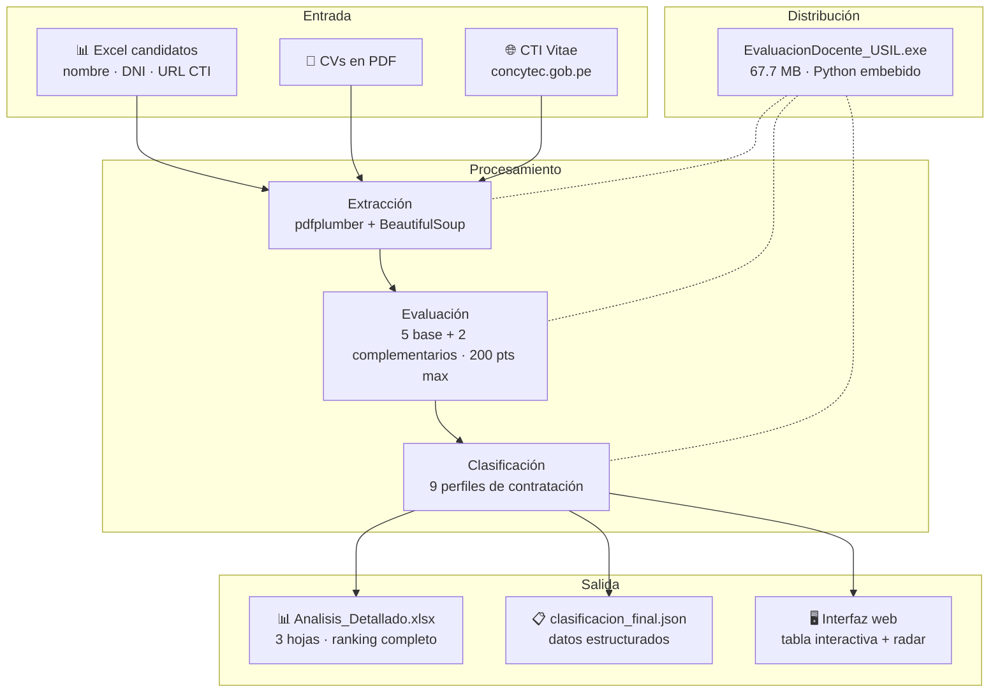
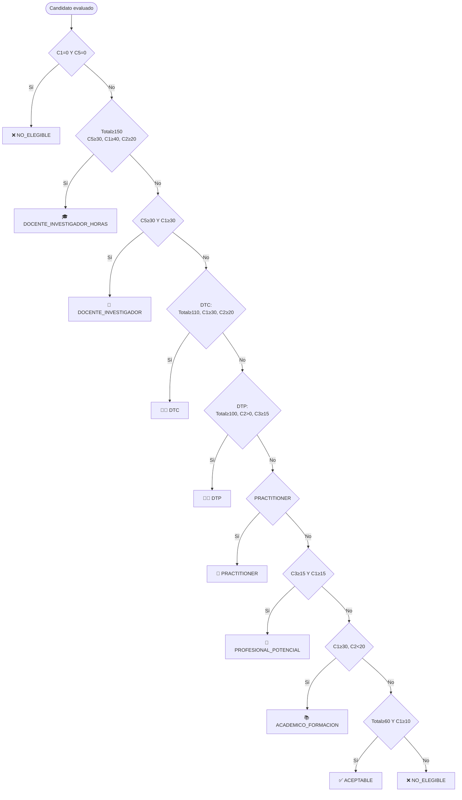
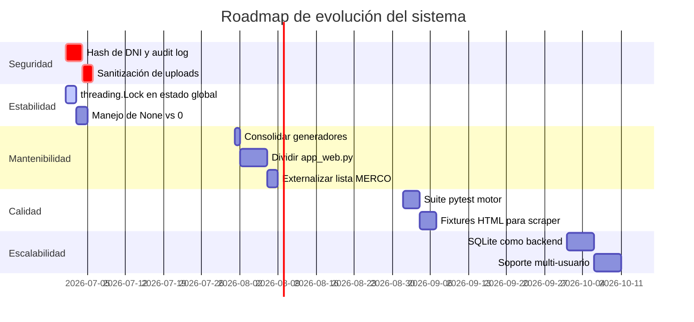

# Portafolio del Proyecto — Sistema de Evaluación Automática de Docentes USIL

**Universidad San Ignacio de Loyola · People Analytics**
**Versión:** 3.0 · **Fecha:** 2026-06-01
**Área:** Automatización de procesos de selección de talento académico

---

## Índice

1. [Contexto y problema](#1-contexto-y-problema)
2. [Solución desarrollada](#2-solución-desarrollada)
3. [Impacto y métricas](#3-impacto-y-métricas)
4. [Decisiones técnicas clave](#4-decisiones-técnicas-clave)
5. [Tecnologías utilizadas](#5-tecnologías-utilizadas)
6. [Arquitectura a alto nivel](#6-arquitectura-a-alto-nivel)
7. [Rúbrica institucional implementada](#7-rúbrica-institucional-implementada)
8. [Complejidades técnicas resueltas](#8-complejidades-técnicas-resueltas)
9. [Limitaciones conocidas y evolución futura](#9-limitaciones-conocidas-y-evolución-futura)
10. [Equipo y contexto institucional](#10-equipo-y-contexto-institucional)

---

## 1. Contexto y problema

### La situación antes del sistema

La Universidad San Ignacio de Loyola realiza convocatorias docentes periódicas que involucran la revisión manual de decenas o cientos de candidatos por proceso. El equipo de People Analytics debía:

1. Buscar manualmente el perfil de cada candidato en CTI Vitae (plataforma nacional CONCYTEC de registro académico)
2. Leer cada CV en PDF
3. Aplicar manualmente la rúbrica institucional base de 5 criterios
4. Construir el ranking en Excel de forma manual
5. Clasificar a cada candidato en el perfil de contratación correspondiente

### Los problemas concretos

| Problema | Impacto |
|---------|---------|
| **Tiempo:** revisión manual de 50 candidatos tomaba ~2 días de trabajo | Retraso en la toma de decisiones de contratación |
| **Variabilidad:** evaluadores distintos podían puntuar el mismo CV diferente | Inequidad y cuestionabilidad del proceso |
| **Escalabilidad:** a mayor número de candidatos, el proceso se volvía inmanejable | Cuellos de botella en convocatorias grandes |
| **Trazabilidad:** no quedaba registro claro del criterio aplicado por evaluador | Dificultad para defender decisiones ante impugnaciones |
| **Datos dispersos:** información en CTI Vitae + PDFs + Excel = 3 fuentes manuales | Alto costo de consolidación |

---

## 2. Solución desarrollada

### ¿Qué se construyó?

Un sistema de evaluación automática que, dado un Excel con candidatos y sus URLs de CTI Vitae, realiza todo el proceso de manera autónoma en minutos:

```
Entrada                    Proceso automático                  Salida
─────────                  ──────────────────                  ──────
Excel candidatos      →    Extracción CTI Vitae       →    Ranking Excel
(nombre, DNI, URL)         Parseo de PDFs                  Ranking JSON
                           Evaluación 5+2 criterios        Perfil por candidato
CVs en PDF            →    Clasificación de perfil     →    Gráficos radar
```

### Alcance del sistema

El sistema cubre de extremo a extremo el proceso de evaluación:

1. **Extracción automatizada** de datos académicos de CTI Vitae por candidato
2. **Extracción de texto** de CVs en formato PDF
3. **Evaluación** según 5 criterios base de la rúbrica y 2 criterios complementarios implementados en el motor
4. **Detección dinámica del tipo de perfil** para aplicar pesos diferenciados (clínico, investigador, industrial, docente)
5. **Clasificación** en 9 perfiles de contratación
6. **Generación de reportes** descargables en Excel y JSON
7. **Interfaz web local** con progreso en tiempo real, tabla interactiva y gráficos radar
8. **Distribución standalone** como ejecutable `.exe` sin dependencias externas

---

## 3. Impacto y métricas

### Reducción de tiempo estimada

| Proceso | Tiempo manual | Tiempo con sistema | Reducción |
|---------|:------------:|:-----------------:|:---------:|
| 10 candidatos | 4 horas | 2–3 minutos | **~98%** |
| 50 candidatos | 2 días | 8–10 minutos | **~99%** |
| 100 candidatos | 4 días | 15–20 minutos | **~99%** |

### Estandarización del proceso

Antes del sistema, la evaluación era subjetiva y dependía del evaluador. Con el sistema:
- **Un único criterio** aplicado de forma idéntica a todos los candidatos
- **La misma lógica** en cada convocatoria del año
- **Resultados reproducibles**: el mismo CV produce siempre el mismo puntaje

### Capacidad de procesamiento

| Métrica | Valor |
|---------|-------|
| Candidatos por evaluación (máximo probado) | 100+ |
| Velocidad de extracción CTI Vitae | ~3–5 segundos/candidato |
| Velocidad de parseo PDF | ~2 documentos/segundo |
| Velocidad de evaluación (motor puro) | <2 segundos para 1 000 candidatos |
| Tamaño del ejecutable distribuible | 67.7 MB |

---

## 4. Decisiones técnicas clave

### Decisión 1: Flask como servidor web local en lugar de aplicación de escritorio

**Alternativas consideradas:**
- PyQt5 / tkinter (GUI de escritorio nativa)
- Flask (servidor web local)
- Electron (aplicación de escritorio con web)

**Elección:** Flask + HTML/JS en localhost

**Justificación:**
- La interfaz web permite usar herramientas familiares (HTML/CSS/JS) sin aprender frameworks de escritorio
- El usuario accede con el navegador que ya conoce
- PyInstaller empaqueta Flask sin problema como parte del .exe
- No requiere instalación de runtime adicional (a diferencia de Electron que embebe Chromium)

**Trade-off asumido:** La solución no funciona desconectada del localhost; se necesita que el .exe esté corriendo para que la UI funcione.

---

### Decisión 2: PyInstaller --onefile para distribución

**Alternativas consideradas:**
- Instalador MSI (complejo de mantener)
- Carpeta con Python + librerías (frágil, 200+ MB)
- Un único .exe (PyInstaller --onefile)

**Elección:** Un único `.exe` de 67.7 MB

**Justificación:**
- Los usuarios finales (coordinadores académicos) no tienen conocimientos técnicos
- Un solo archivo es más fácil de distribuir por correo / OneDrive
- No requiere privilegios de administrador para ejecutar
- Se puede actualizar simplemente reemplazando el archivo

**Trade-off asumido:** El primer arranque es lento (~5–10 segundos) porque PyInstaller extrae los archivos a un directorio temporal.

---

### Decisión 3: CTI Vitae via scraping HTML (sin API oficial)

**Alternativas consideradas:**
- API oficial de CONCYTEC (no existe públicamente)
- Scraping del HTML de la plataforma
- Importación manual de datos (Excel de CTI Vitae)

**Elección:** Scraping con requests + BeautifulSoup

**Justificación:**
- No existe API pública de CTI Vitae al momento del desarrollo
- El scraping es la única forma de automatizar la extracción de datos actualizados
- Implementación de reintentos con backoff para manejar inestabilidades de la plataforma

**Trade-off asumido:** Dependencia frágil: cualquier rediseño del HTML de CTI Vitae rompe la extracción. Se requiere monitoreo periódico.

---

### Decisión 4: Persistencia en archivos JSON/Excel en lugar de base de datos

**Alternativas consideradas:**
- SQLite (embebido)
- JSON + Excel (sistema de archivos)
- PostgreSQL / MySQL (servidor)

**Elección:** JSON + Excel

**Justificación:**
- El sistema es monousuario (un evaluador a la vez)
- Los resultados deben ser legibles sin herramientas especiales
- El Excel es el formato nativo de trabajo del equipo de People Analytics
- No requiere instalación de base de datos en el equipo del usuario

**Trade-off asumido:** No escala a múltiples usuarios concurrentes; los archivos JSON no son consultables eficientemente para historiales grandes.

---

### Decisión 5: Pesos dinámicos por tipo de perfil

**Descripción:** El sistema detecta automáticamente si el candidato tiene perfil clínico, investigador, industrial o docente, y aplica pesos diferenciados en los criterios de evaluación.

**Justificación:**
- Un médico especialista evaluado con los mismos pesos que un docente de negocio produciría resultados sesgados
- La rúbrica institucional reconoce que distintos tipos de docentes tienen distintos perfiles de fortaleza
- Los pesos diferenciales producen clasificaciones más justas sin cambiar la escala de puntuación

**Implementación:** `PESOS_POR_TIPO` en `config.py` + `_detectar_tipo_perfil()` en `motor_evaluacion.py`

---

## 5. Tecnologías utilizadas

### Stack principal

| Capa | Tecnología | Versión | Propósito |
|------|-----------|---------|-----------|
| Lenguaje | Python | 3.13+ | Lenguaje principal |
| Web framework | Flask | 3.0.0 | Servidor HTTP + enrutamiento |
| Extracción PDF | pdfplumber | 0.10.3 | Parser de PDFs (primario) |
| Extracción PDF fallback | PyPDF2 | 3.0.1 | Parser de PDFs (fallback) |
| Web scraping | requests | ≥2.31.0 | Cliente HTTP |
| HTML parsing | BeautifulSoup4 | ≥4.12.0 | Parser de CTI Vitae |
| Datos tabulares | pandas | ≥2.1.4 | Lectura de Excel, manipulación |
| Excel output | openpyxl | ≥3.1.5 | Generación de reportes .xlsx |
| Fechas | python-dateutil | 2.8.2 | Parsing de fechas en texto libre |
| Numérico | numpy | ≥1.26.3 | Cálculos estadísticos |
| Compilación | PyInstaller | — | Build del ejecutable .exe |
| Frontend | HTML/CSS/JS | — | Interfaz de usuario |
| Gráficos | Chart.js | CDN | Visualización radar |

### Herramientas de desarrollo

| Herramienta | Propósito |
|------------|-----------|
| Python venv | Gestión de entornos virtuales |
| pip | Gestión de paquetes |
| PyInstaller | Compilación a .exe |
| VS Code | Editor principal |

---

## 6. Arquitectura a alto nivel



---

## 7. Rúbrica institucional implementada

El sistema implementa la rúbrica base de USIL para selección docente y la amplía en código con dos criterios complementarios:

### Tabla de puntajes por criterio

| Criterio | Nivel | Puntos |
|---------|-------|:------:|
| **C1 — Formación académica** | Doctorado completo | 50 |
| | Doctorado en curso | 40 |
| | Maestría completa | 30 |
| | Maestría en curso | 25 |
| | Licenciatura / Título profesional | 15 |
| | Bachiller | 10 |
| | Estudiante universitario | 5 |
| | Sin evidencia | 0 |
| **C2 — Experiencia docente** | ≥ 10 años | 40 |
| | 6–9 años | 30 |
| | 3–5 años | 20 |
| | 0–2 años | 0 |
| **C3 — Experiencia profesional** | Alta dirección | 40 |
| | Mando medio | 30 |
| | Senior profesional | 25 |
| | Intermedio / Junior | 15 |
| | Analista / Operativo | 10 |
| | Sin experiencia | 0 |
| **C4 — Centro de labores** | Empresa TOP 100 MERCO / Hospital alta complejidad | 20 |
| | Big 4 / Institución reconocida | 15 |
| | Empresa mediana | 10 |
| | Independiente | 0 |
| **C5 — Producción académica** | Libros / Artículos en revistas indexadas | 40 |
| | Artículos Scopus / WoS | 30 |
| | Proyectos de investigación | 30 |
| | Producción inicial | 10 |
| | Sin evidencia | 0 |
| **C6 — Liderazgo** | Alto liderazgo | 20 |
| | Liderazgo medio | 15 |
| | Liderazgo básico | 10 |
| | Sin evidencia | 0 |
| **C7 — Especialización** | Alta especialización | 10 |
| | Especialización media | 6 |
| | Especialización básica | 3 |
| | Sin especialización | 0 |

### Reglas de clasificación en perfil de contratación



---

## 8. Complejidades técnicas resueltas

### Problema 1: Inestabilidad de CTI Vitae

CTI Vitae es una plataforma pública con carga variable. Muchos perfiles tardan en responder o retornan errores intermitentes.

**Solución implementada:**
- Sistema de reintentos con backoff (3 intentos · timeout creciente: 35s, 55s, 75s)
- Estado de progreso thread-safe por candidato
- Degradación elegante: si falla la extracción web, se usa el PDF si existe

---

### Problema 2: Variabilidad del formato de los CVs en PDF

Los CVs llegan en formatos muy distintos: una columna, dos columnas, escaneados, en Word exportado a PDF, con tablas, con imágenes.

**Solución implementada:**
- pdfplumber como parser primario (mejor manejo de columnas y tablas)
- PyPDF2 como fallback (más permisivo con PDFs mal formados)
- Extracción de texto libre sin asumir estructura

---

### Problema 3: Detección de nivel académico en texto no estructurado

El texto de CTI Vitae y de los PDFs usa distintas palabras para referirse a los mismos conceptos ("Doctor en...", "Ph.D.", "Doctorado en...", "PhD").

**Solución implementada:**
- Vocabulario extenso de keywords (>1 000 términos en `config.py`)
- Matching case-insensitive con normalización de texto
- Prioridad de campos estructurados (CTI Vitae) sobre texto libre (PDFs)

---

### Problema 4: Distribución a usuarios sin conocimientos técnicos

Los coordinadores académicos no pueden instalar Python ni librerías.

**Solución implementada:**
- PyInstaller con `--onefile` empaqueta todo en un único `.exe` de 67.7 MB
- Python 3.13 embebido: no requiere instalación
- Flask inicia automáticamente y abre el navegador del usuario
- Las carpetas de trabajo se crean automáticamente si no existen

---

### Problema 5: Retroalimentación en tiempo real para procesos largos

Una evaluación de 50–100 candidatos puede durar varios minutos. El usuario necesita saber que el sistema está funcionando.

**Solución implementada:**
- Server-Sent Events (SSE) para streaming del progreso sin necesidad de WebSocket
- Actualización por candidato: el usuario ve en tiempo real quién está siendo procesado
- Barra de progreso con porcentaje, nombre del candidato actual y tiempo estimado

---

## 9. Limitaciones conocidas y evolución futura

### Limitaciones actuales

| Limitación | Descripción |
|-----------|-------------|
| **Un usuario simultáneo** | Dos evaluaciones paralelas producen resultados inconsistentes |
| **Solo Windows** | El .exe es exclusivo para Windows; no hay versión para macOS o Linux |
| **Scraper frágil** | Depende del HTML actual de CTI Vitae; un rediseño del sitio lo rompe |
| **Lista MERCO anual** | Requiere editar código Python para actualizar |
| **Sin autenticación** | Cualquier persona en el mismo equipo puede usarlo |
| **Sin API oficial CONCYTEC** | No hay garantía de acceso a largo plazo |
| **PDFs escaneados** | El sistema no puede procesar imágenes de CV (solo PDF con texto) |

### Hoja de ruta propuesta



---

## 10. Equipo y contexto institucional

### Área responsable

**People Analytics — Universidad San Ignacio de Loyola**

El sistema fue desarrollado como parte del proyecto **TREINNE** (Transformación e Innovación en la Selección de Talento Académico), dentro de la línea de automatización de procesos de gestión del talento docente.

### Contexto de uso

- **Frecuencia:** Utilizado en convocatorias docentes semestrales (semestres 2026-1, 2026-2, etc.)
- **Usuarios directos:** Equipo de People Analytics (2–3 analistas)
- **Usuarios indirectos:** Coordinadores académicos que reciben los reportes Excel
- **Decisiones que apoya:** Shortlisting de candidatos para entrevista, clasificación por perfil de contratación

### Documentación relacionada

| Documento | Descripción |
|-----------|-------------|
| [README.md](README.md) | Inicio rápido y visión general |
| [ARQUITECTURA.md](ARQUITECTURA.md) | Diagramas y decisiones de diseño |
| [MANUAL_TECNICO.md](MANUAL_TECNICO.md) | Referencia técnica completa |
| [MANUAL_USUARIO.md](MANUAL_USUARIO.md) | Guía de uso para usuarios finales |
| [API_REFERENCE.md](API_REFERENCE.md) | Especificación de endpoints REST |
| [AUDITORIA_CODIGO.md](AUDITORIA_CODIGO.md) | Vulnerabilidades, deuda técnica y remediación |
| [INVENTARIO_TECNICO.md](INVENTARIO_TECNICO.md) | Inventario exhaustivo del código fuente |
| `ARQUITECTURA_TECNICA.md` *(raíz)* | Documentación técnica original (650 líneas) |

---

*Universidad San Ignacio de Loyola · People Analytics*
*Proyecto TREINNE — Proyectos Aplicados · 2026*
